<div align="center">


### Plataforma de gerenciamento de chamados técnicos (Help Desk / ITSM)

*Conectando pessoas, resolvendo problemas.*

</div>

---

## Sobre o projeto

**Orbe** é um aplicativo mobile de Help Desk corporativo. Usuários abrem chamados
técnicos, acompanham o andamento, comentam e avaliam o atendimento; um painel de
administrador/técnico centraliza indicadores, atende os chamados de todo o sistema
e gerencia usuários e categorias.

Projeto de portfólio construído com foco em arquitetura limpa e escalável — todo o
backend hoje é **mock/local** (repositórios em memória por trás de interfaces
abstratas), pensado para ser substituído por Firebase (ou outro backend real) sem
alterar a camada de UI.

## Stack técnica

| Camada | Tecnologia |
|---|---|
| Framework | Flutter + Dart |
| Design | Material Design 3 |
| Estado | [Riverpod](https://riverpod.dev) |
| Navegação | [GoRouter](https://pub.dev/packages/go_router) — `StatefulShellRoute` para abas, com redirecionamento automático por papel de usuário |
| Gráficos | [fl_chart](https://pub.dev/packages/fl_chart) |
| Câmera/Galeria | [image_picker](https://pub.dev/packages/image_picker) |
| Perfis de demonstração | API pública [randomuser.me](https://randomuser.me) |

## Boas práticas aplicadas

- **Repository pattern com interfaces abstratas** — cada fonte de dados (contas,
  chamados, comentários, categorias, perfil externo) é definida como uma interface
  (`AuthRepository`, `TicketRepository`, ...) implementada hoje por uma versão mock
  em memória. Trocar por Firebase ou outro backend no futuro não exige tocar em
  providers, telas ou widgets — só a implementação por trás da interface.
- **Separação clara de responsabilidades** — `models/` (entidades de domínio),
  `services/` (acesso a dados), `providers/` (estado), `pages/` (telas), `widgets/`
  (componentes reutilizáveis) e `styles/` (tema) nunca se misturam.
- **Gerenciamento de estado reativo com Riverpod** — `AsyncNotifier` cuida de
  loading/erro/sucesso automaticamente; as telas só reagem ao estado, sem lógica
  assíncrona duplicada.
- **Design system centralizado** — cores, tipografia e tema vivem só em `styles/`;
  nenhuma tela usa cor ou fonte "no chute".
- **Componentes reutilizáveis de verdade** — `CustomButton`, `CustomTextField`,
  `TicketCard`, `StatusBadge`, `CommentsList` etc. são usados em várias telas,
  evitando duplicação de UI.
- **Navegação declarativa e protegida por papel** — GoRouter com `redirect`
  automático: uma conta de usuário comum nunca alcança rotas de administrador, e
  vice-versa, sem precisar de checagem manual em cada tela.
- **Resiliência a falhas de rede** — quando a API externa (randomuser.me) falha ou
  está indisponível, a UI cai de volta para um estado padrão (iniciais no lugar da
  foto) em vez de quebrar.
- **Código limpo e verificado** — `flutter analyze` sem nenhum aviso, e testes
  automatizados cobrindo o fluxo de autenticação.

## Como rodar

```bash
flutter pub get
```

**Web:**

```bash
flutter run -d chrome
```

**Dispositivo físico conectado (Android/iOS):**

```bash
flutter run
```

**Emulador Android:**

```bash
flutter emulators                      # lista os emuladores instalados
flutter emulators --launch <id>        # abre o emulador escolhido (ex: Pixel_9)
flutter devices                        # confirma que o emulador aparece como device
flutter run -d emulator-5554           # roda o app nele
```

Se nenhum emulador aparecer, crie um pelo **Android Studio → Device Manager** (ou
via `avdmanager`, da Android SDK) e rode `flutter emulators` novamente.

## Contas de acesso

O app não tem cadastro obrigatório para testar — use uma das contas abaixo:

| Papel | E-mail | Senha |
|---|---|---|
| Usuário comum | `demo@orbe.com` | `123456` |
| Administrador / Técnico | `admin@orbe.com` | `123456` |

Também é possível criar uma conta nova de usuário comum pela tela de Cadastro,
inclusive gerando uma identidade (nome, foto, telefone, localização) automaticamente
a partir da API randomuser.me — veja a seção [Cadastro](#cadastro).

---

## Manual de uso

O app tem duas experiências completamente separadas: a de **usuário comum** e a de
**administrador/técnico**. O papel da conta logada decide qual delas você vê — não
é possível alternar entre as duas sem trocar de conta.

### Autenticação

#### Login

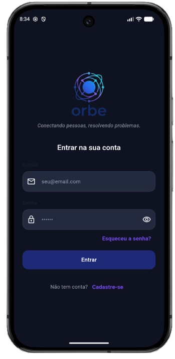

Tela de entrada do app. Pede e-mail e senha; "Esqueceu a senha?" leva à recuperação,
"Cadastre-se" leva ao cadastro. Após autenticar, o app redireciona automaticamente
para a área correta (usuário comum ou administrador) de acordo com o papel da conta.

#### Cadastro

<p align="center">
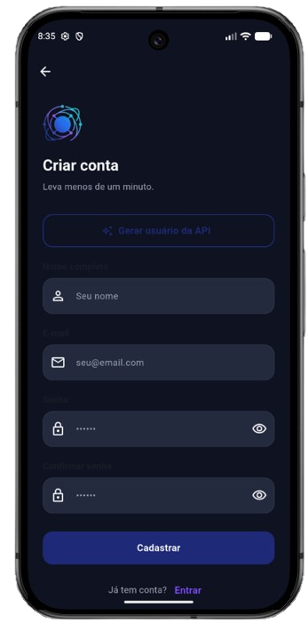
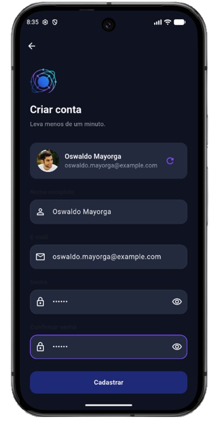
</p>

Cria uma nova conta de usuário comum. O botão **"Gerar usuário da API"** busca uma
pessoa aleatória em randomuser.me e preenche automaticamente nome e e-mail (editáveis,
segunda imagem); essa identidade — incluindo foto, telefone e localização — fica
**permanentemente vinculada** à conta a partir do cadastro, e aparece depois na tela
de Perfil. A senha é sempre escolhida por quem se cadastra.

#### Recuperar senha

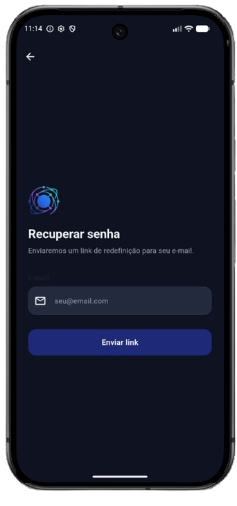

Fluxo simulado de recuperação: informa o e-mail e recebe a confirmação de envio do
link (não há envio real de e-mail, é um mock).

---

### Área do Usuário

Navegação por barra inferior com três abas: **Início**, **Chamados** e **Perfil**.

#### Início

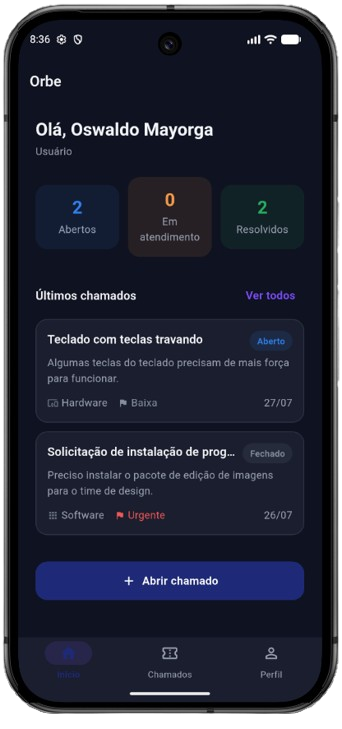

Dashboard pessoal: saudação, cards com a contagem de chamados por status (Abertos /
Em atendimento / Resolvidos), os dois chamados mais recentes e um atalho para abrir
um novo chamado sem precisar trocar de aba.

#### Chamados

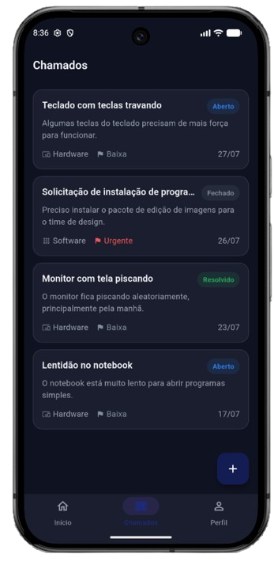

Lista completa dos chamados abertos pelo usuário, com status, categoria, prioridade
e data. Toque em qualquer card para ver o detalhe; o botão **+** abre um novo chamado.

#### Abrir chamado

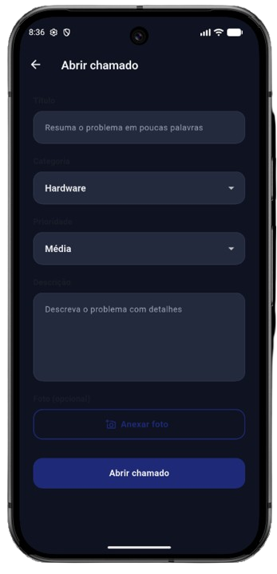

Formulário de abertura: título, categoria (lista mantida pelo administrador),
prioridade, descrição e uma foto opcional anexada pela câmera ou pela galeria do
dispositivo.

#### Detalhe do chamado

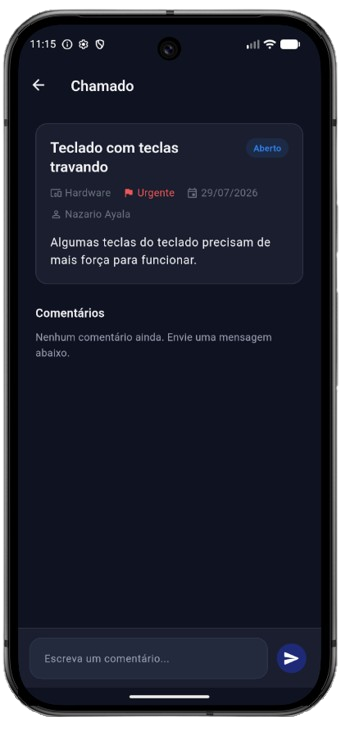

Mostra todas as informações do chamado (incluindo a foto anexada, se houver) e um
chat de comentários entre o usuário e o técnico responsável. Quando o chamado é
marcado como **Resolvido**, aparece um formulário para avaliar o atendimento
(1 a 5 estrelas + comentário opcional).

#### Perfil

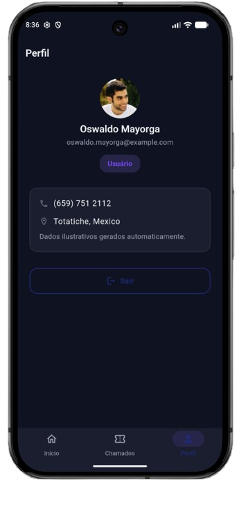

Dados da conta (nome, e-mail, papel) e, quando a conta foi criada via "Gerar usuário
da API", a foto, telefone e localização vinculados a ela. Botão **Sair** encerra a
sessão.

---

### Área do Administrador / Técnico

Navegação por barra inferior com quatro abas: **Dashboard**, **Chamados**,
**Usuários** e **Categorias**. Representa quem atende e gerencia os chamados de toda
a empresa — não abre chamados para si mesmo.

#### Dashboard

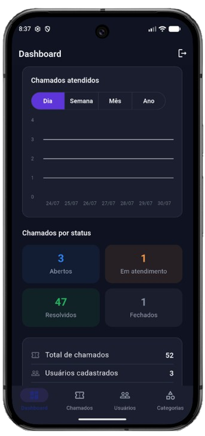

Gráfico de chamados **atendidos** (resolvidos), com seletor **Dia / Semana / Mês /
Ano** — toque em uma barra para ver o valor exato. Abaixo, cards com a contagem de
chamados por status e os totais de chamados, usuários e categorias no sistema.

#### Chamados (Todos os chamados)

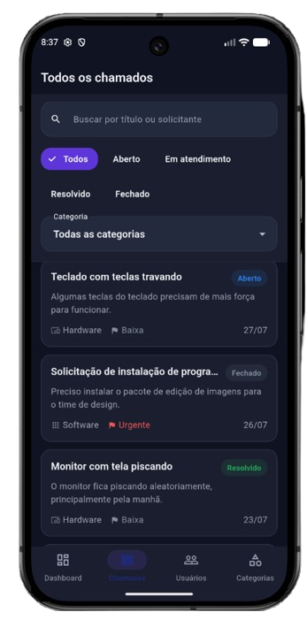

Todos os chamados abertos por qualquer usuário do sistema, mais recentes primeiro.
Barra de filtro no topo: busca por título ou nome do solicitante, chips de status
(Aberto / Em atendimento / Resolvido / Fechado) e um seletor de categoria.

#### Atender chamado

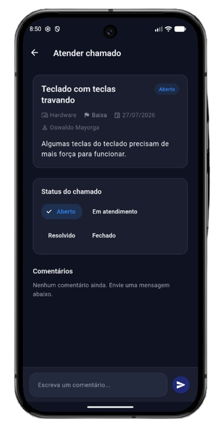

Aberta ao tocar em um chamado na lista. Mostra as informações completas, chips para
mudar o status do chamado (registrando quando ele foi atendido, para o gráfico do
Dashboard), a avaliação do usuário quando houver, e o mesmo chat de comentários que
o usuário vê — o técnico responde por aqui.

#### Usuários

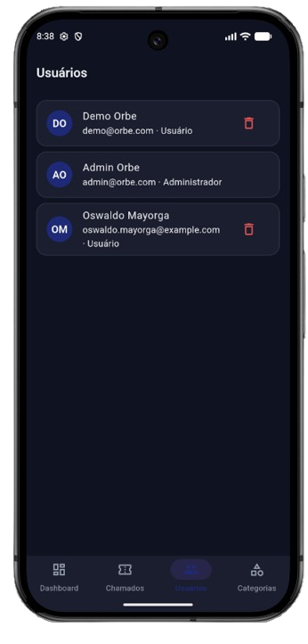

Lista de todas as contas cadastradas (nome, e-mail, papel), com opção de remover
uma conta permanentemente. A própria conta logada não pode ser removida por aqui.

#### Categorias

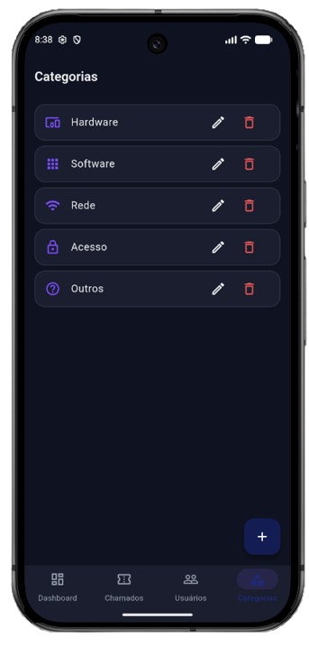

Lista de categorias de chamado disponíveis, com opções para criar uma nova, renomear
ou remover uma existente. Alterações afetam apenas chamados novos — chamados já
abertos mantêm o nome da categoria que tinham no momento da criação.

---

## Estrutura do projeto

```
lib/
├── assets/          # imagens e vídeos
├── models/          # entidades de domínio (Ticket, AppUser, Comment, ...)
├── pages/           # telas completas
├── providers/       # estado (Riverpod)
├── routing/          # configuração do GoRouter
├── services/        # repositórios (contratos + implementação mock)
├── styles/          # cores, tipografia, tema
├── utils/           # helpers reutilizáveis
├── widgets/         # componentes reutilizáveis
└── main.dart
```
